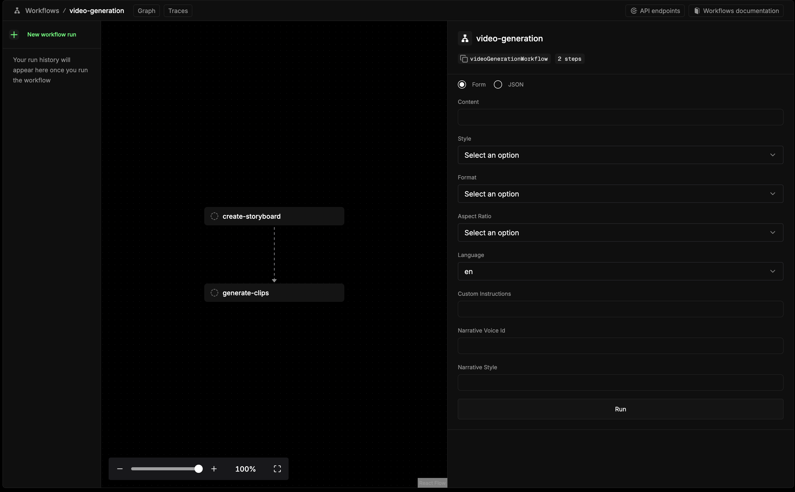

# Open Video Overview

An open-source alternative to [NotebookLM's Video Overview](https://notebooklm.google.com). Built with [Mastra](https://mastra.ai) to create narrated videos from text using AI-generated images (Gemini Nano Banana Pro) and voice (ElevenLabs).

> This was quickly built as an experiment. Expect rough edges.

## Examples

### Generated Video Examples

**Example 1: Repository Explainer (Retro Style, 16:9)**

[](https://youtu.be/jy_Z54TKGTw)

*Brief format video explaining this repository in retro visual style*

**Example 2: Why Are Planets Round? (Anime Style, 9:16)**

[](https://www.youtube.com/shorts/AgLiCGqHYCE)

*Short-form vertical video in anime visual style*

### Mastra Workflow Playground



*The interactive Mastra playground interface for running video generation workflows*

## What it does

- Generates video storyboards from text content
- Creates images using Gemini
- Generates narration using ElevenLabs TTS
- Supports 25+ visual styles (watercolor, anime, 3b1b, etc.)
- Supports 16 languages
- Outputs MP4 videos with narration and visuals

## Prerequisites

- **Node.js** 18+ and **pnpm**
- **ffmpeg** and **ffprobe** (for video processing)
  ```bash
  # macOS
  brew install ffmpeg

  # Ubuntu/Debian
  sudo apt install ffmpeg
  ```
- **Mammouth AI API Key** ([Get one here](https://mammouth.ai))
- **ElevenLabs API Key** ([Get one here](https://elevenlabs.io/))

## Installation

```bash
# Clone the repository
git clone https://github.com/baturyilmaz/open-video-overview.git
cd open-video-overview

# Install dependencies
pnpm install

# Configure environment variables
cp .env.example .env
# Edit .env with your API keys
```

## Configuration

Create a `.env` file with your API keys:

```env
MAMMOUTH_API_KEY=your_mammouth_api_key
ELEVENLABS_API_KEY=your_elevenlabs_api_key
```

## Development Setup

This project uses a **single-process webhook vocabulary** for event-driven architecture. All services are registered as handlers within the main Mastra process.

### Start the server
```bash
npm install
npm run dev
```

Visit `http://localhost:3000` to start using the API.

**Architecture:** Events like `image.generate` and `audio.generate` are routed to their handlers in-process with no HTTP overhead. This keeps the system simple for MVP while maintaining the vocabulary to extract services later if needed.

See **[Webhook Architecture Guide](docs/WEBHOOK_ARCHITECTURE.md)** for architecture details.

## Next.js SDK

Use the Video Overview SDK to integrate from your Next.js app:

```bash
npm install @videooverview/sdk
```

**Quick example:**
```typescript
"use client";
import { useGenerateImage } from "@videooverview/sdk";

export function ImageGenerator() {
  const { generate, loading, data } = useGenerateImage();
  
  return (
    <div>
      <button onClick={() => generate({ prompt: "A sunset" })}>
        {loading ? "Generating..." : "Generate Image"}
      </button>
      {data?.imageData && }
    </div>
  );
}
```

See **[SDK Setup Guide](sdk/next/SETUP.md)** for full integration instructions and API reference.

## Usage

### Development Server

Start the Mastra development server with interactive playground:

```bash
pnpm run dev
```

Access the playground at [http://localhost:4111](http://localhost:4111)

### Video Generation Workflow

The `videoGenerationWorkflow` accepts:

**Required Parameters:**
- `content` (string): Source content for the video
- `style` (string): Visual style (see available styles below)
- `format` (string): "explainer" or "brief"
- `aspectRatio` (string): "16:9" or "9:16"

**Optional Parameters:**
- `language` (string): ISO language code (default: "en")
- `customInstructions` (string): Additional instructions for generation
- `narrativeVoiceId` (string): ElevenLabs voice ID
- `narrativeStyle` (string): Narrative tone (e.g., "casual", "professional", "storytelling")

### Visual Styles

watercolor, anime, retro, whiteboard, classic, cinematic, isometric, flat, comic, neon, oil, sketch, papercut, popart, storybook, pixel, minimalist, infographic, documentary, gothic, pastel, 3b1b, corporate, presentation, tech

### Output

Generated videos are saved to `output/<project-name>-<timestamp>/`:
- `images/` - AI-generated images
- `audio/` - Narration audio files
- `videos/` - Individual video clips
- `<title>-final.mp4` - Complete concatenated video

## Development Commands

```bash
pnpm run dev          # Start Mastra dev server
pnpm run build        # Build the project
pnpm run typecheck    # Run TypeScript type checking
pnpm run lint         # Run ESLint
pnpm run format       # Format code with Prettier
```

## Architecture

The `videoGenerationWorkflow` handles the complete pipeline:
1. Generate storyboard from source content
2. For each clip: create transcript, generate image, produce audio, combine into video
3. Concatenate all clips into final video

## Contributing

PRs welcome.

## Credits

Inspired by [NotebookLM's Video Overview](https://notebooklm.google.com).

## License

MIT
